# 📐 UML Diagrams
## Class Diagrams & Sequence Diagrams

**Project**: Applicant Selector Simulator  
**Repository**: https://github.com/Roshan9010/Selector-Applicant-Simulator  
**Last Updated**: March 26, 2026

---

## 🏗️ Class Diagrams

### 1. Complete System Class Diagram

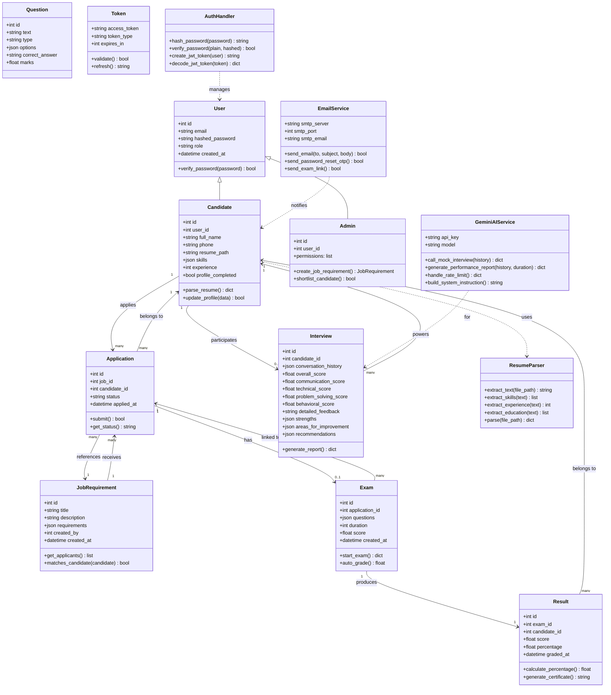
```mermaid
classDiagram
    %% User Management Classes
    class User {
        +int id
        +string email
        +string hashed_password
        +string role
        +datetime created_at
        +verify_password(password) bool
    }

    class Candidate {
        +int id
        +int user_id
        +string full_name
        +string phone
        +string resume_path
        +json skills
        +int experience
        +bool profile_completed
        +parse_resume() dict
        +update_profile(data) bool
    }

    class Admin {
        +int id
        +int user_id
        +permissions: list
        +create_job_requirement() JobRequirement
        +shortlist_candidate() bool
    }

    %% Job Management Classes
    class JobRequirement {
        +int id
        +string title
        +string description
        +json requirements
        +int created_by
        +datetime created_at
        +get_applicants() list
        +matches_candidate(candidate) bool
    }

    class Application {
        +int id
        +int job_id
        +int candidate_id
        +string status
        +datetime applied_at
        +submit() bool
        +get_status() string
    }

    %% Exam Management Classes
    class Exam {
        +int id
        +int application_id
        +json questions
        +int duration
        +float score
        +datetime created_at
        +start_exam() dict
        +auto_grade() float
    }

    class Question {
        +int id
        +string text
        +string type
        +json options
        +string correct_answer
        +float marks
    }

    class Result {
        +int id
        +int exam_id
        +int candidate_id
        +float score
        +float percentage
        +datetime graded_at
        +calculate_percentage() float
        +generate_certificate() string
    }

    %% Interview Management Classes
    class Interview {
        +int id
        +int candidate_id
        +json conversation_history
        +float overall_score
        +float communication_score
        +float technical_score
        +float problem_solving_score
        +float behavioral_score
        +string detailed_feedback
        +json strengths
        +json areas_for_improvement
        +json recommendations
        +generate_report() dict
    }

    %% Authentication Classes
    class Token {
        +string access_token
        +string token_type
        +int expires_in
        +validate() bool
        +refresh() string
    }

    class AuthHandler {
        +hash_password(password) string
        +verify_password(plain, hashed) bool
        +create_jwt_token(user) string
        +decode_jwt_token(token) dict
    }

    %% AI Service Classes
    class GeminiAIService {
        +string api_key
        +string model
        +call_mock_interview(history) dict
        +generate_performance_report(history, duration) dict
        +handle_rate_limit() dict
        +build_system_instruction() string
    }

    %% Email Service Classes
    class EmailService {
        +string smtp_server
        +int smtp_port
        +string smtp_email
        +send_email(to, subject, body) bool
        +send_password_reset_otp() bool
        +send_exam_link() bool
    }

    %% Resume Parser Classes
    class ResumeParser {
        +extract_text(file_path) string
        +extract_skills(text) list
        +extract_experience(text) int
        +extract_education(text) list
        +parse(file_path) dict
    }

    %% Relationships - User Hierarchy
    User <|-- Candidate
    User <|-- Admin

    %% Relationships - Job Applications
    Candidate "1" --> "many" Application : applies
    JobRequirement "1" --> "many" Application : receives
    Application "many" --> "1" Candidate : belongs to
    Application "many" --> "1" JobRequirement : references

    %% Relationships - Exams
    Application "1" --> "0..1" Exam : has
    Exam "many" --> "1" Application : linked to
    Exam "1" --> "1" Result : produces
    Result "many" --> "1" Candidate : belongs to

    %% Relationships - Interviews
    Candidate "1" --> "0..many" Interview : participates
    Interview "many" --> "1" Candidate : for

    %% Relationships - Services
    Candidate ..> ResumeParser : uses
    AuthHandler ..> User : manages
    GeminiAIService ..> Interview : powers
    EmailService ..> Candidate : notifies
```

---

### 2. Database Schema Class Diagram

```mermaid
class Diagram
    class users {
        <<table>>
        ----
        id: PK (Integer)
        email: VARCHAR (Unique)
        hashed_password: VARCHAR
        role: ENUM ('ADMIN', 'CANDIDATE')
        created_at: TIMESTAMP
    }

    class candidates {
        <<table>>
        ----
        id: PK (Integer)
        user_id: FK → users.id
        full_name: VARCHAR
        phone: VARCHAR
        resume_path: VARCHAR
        skills: JSON
        experience: Integer
        profile_completed: Boolean
    }

    class job_requirements {
        <<table>>
        ----
        id: PK (Integer)
        title: VARCHAR
        description: TEXT
        requirements: JSON
        created_by: FK → users.id
        created_at: TIMESTAMP
    }

    class applications {
        <<table>>
        ----
        id: PK (Integer)
        job_id: FK → job_requirements.id
        candidate_id: FK → candidates.id
        status: ENUM
        applied_at: TIMESTAMP
    }

    class exams {
        <<table>>
        ----
        id: PK (Integer)
        application_id: FK → applications.id
        questions: JSON
        duration: Integer
        score: Float
        created_at: TIMESTAMP
    }

    class results {
        <<table>>
        ----
        id: PK (Integer)
        exam_id: FK → exams.id
        candidate_id: FK → candidates.id
        score: Float
        graded_at: TIMESTAMP
    }

    class interviews {
        <<table>>
        ----
        id: PK (Integer)
        candidate_id: FK → candidates.id
        conversation_history: JSON
        overall_score: Float
        communication_score: Float
        technical_score: Float
        problem_solving_score: Float
        behavioral_score: Float
        detailed_feedback: TEXT
        strengths: JSON
        areas_for_improvement: JSON
        recommendations: JSON
    }

    users "1" -- "0..many" candidates : extends
    users "1" -- "0..many" job_requirements : creates
    candidates "1" -- "0..many" applications : submits
    job_requirements "1" -- "0..many" applications : receives
    applications "1" -- "0..1" exams : has
    exams "1" -- "1" results : generates
    candidates "1" -- "0..many" interviews : participates
```

---

### 3. Backend API Router Classes

```mermaid
class Diagram
    class FastAPI {
        <<application>>
        +add_router(router)
        +add_middleware(middleware)
        +run(host, port)
    }

    class AuthRouter {
        <<router>>
        +POST /auth/register
        +POST /auth/login
        +POST /auth/forgot-password
        +POST /auth/reset-password
    }

    class AdminRouter {
        <<router>>
        +GET /admin/candidates
        +POST /admin/requirements
        +GET /admin/requirements
        +GET /admin/shortlist
        +POST /admin/shortlist/{id}
    }

    class CandidateRouter {
        <<router>>
        +GET /candidate/profile
        +POST /candidate/profile
        +POST /candidate/resume
        +GET /candidate/jobs
        +POST /candidate/apply/{id}
        +POST /candidate/mock-interview
        +POST /candidate/mock-interview-report
    }

    class ExamRouter {
        <<router>>
        +GET /exam/{id}
        +POST /exam/{id}/submit
        +GET /exam/{id}/result
    }

    class ChatbotRouter {
        <<router>>
        +POST /chat
    }

    class JWTMiddleware {
        <<middleware>>
        +verify_token(request)
        +inject_user(request)
    }

    class CORSMiddleware {
        <<middleware>>
        +allow_origins: list
        +allow_credentials
        +allow_methods: list
        +allow_headers: list
    }

    FastAPI *-- AuthRouter : contains
    FastAPI *-- AdminRouter : contains
    FastAPI *-- CandidateRouter : contains
    FastAPI *-- ExamRouter : contains
    FastAPI *-- ChatbotRouter : contains
    FastAPI o-- JWTMiddleware : uses
    FastAPI o-- CORSMiddleware : uses
```

---

### 4. Frontend Component Class Diagram

```mermaid
class Diagram
    class App {
        <<component>>
        +routes: array
        +render()
    }

    class Login {
        <<page>>
        +email: string
        +password: string
        +handleSubmit()
        +navigateToDashboard()
    }

    class Register {
        <<page>>
        +email: string
        +password: string
        +confirmPassword: string
        +handleRegister()
    }

    class CandidateDashboard {
        <<page>>
        +profileData: object
        +applications: array
        +loadProfile()
        +handleResumeUpload()
        +navigateToInterview()
    }

    class AdminDashboard {
        <<page>>
        +candidates: array
        +jobs: array
        +loadCandidates()
        +createJobRequirement()
        +shortlistCandidate()
    }

    class MockInterview {
        <<page>>
        +messages: array
        +timeLeft: number
        +selectedTopics: array
        +isListening: bool
        +startInterview()
        +sendMessage()
        +endInterview()
        +generateReport()
    }

    class ExamRoom {
        <<page>>
        +examData: object
        +answers: array
        +timeRemaining: number
        +loadExam()
        +submitAnswer()
        +submitExam()
    }

    class AIChatbot {
        <<component>>
        +isOpen: bool
        +message: string
        +chatHistory: array
        +toggleChat()
        +sendMessage()
    }

    class authStore {
        <<zustand>>
        +token: string
        +role: string
        +email: string
        +login(token, role, email)
        +logout()
    }

    class axiosInstance {
        <<service>>
        +interceptors: object
        +get(url)
        +post(url, data)
        +put(url, data)
        +delete(url)
    }

    App *-- Login : routes to
    App *-- Register : routes to
    App *-- CandidateDashboard : routes to
    App *-- AdminDashboard : routes to
    App *-- MockInterview : routes to
    App *-- ExamRoom : routes to
    App *-- AIChatbot : includes
    
    Login ..> authStore : uses
    Register ..> authStore : uses
    CandidateDashboard ..> authStore : uses
    AdminDashboard ..> authStore : uses
    MockInterview ..> axiosInstance : uses
    ExamRoom ..> axiosInstance : uses
    AIChatbot ..> axiosInstance : uses
```

---

## 🔄 Sequence Diagrams

### 1. User Authentication Sequence

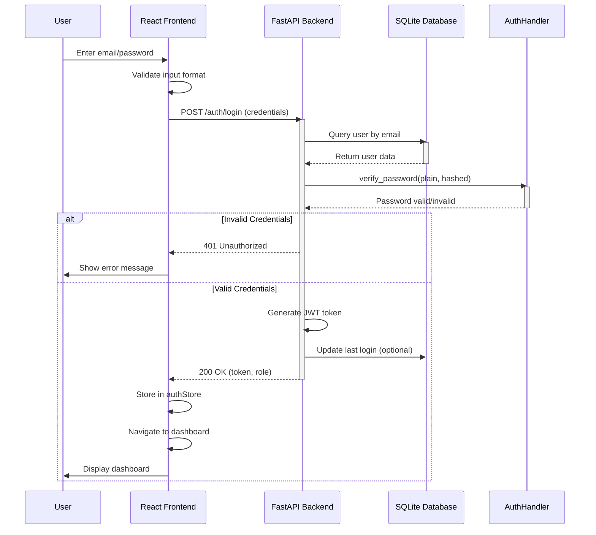
```mermaid
sequenceDiagram
    participant U as User
    participant FE as React Frontend
    participant BE as FastAPI Backend
    participant DB as SQLite Database
    participant Auth as AuthHandler

    U->>FE: Enter email/password
    FE->>FE: Validate input format
    FE->>BE: POST /auth/login (credentials)
    
    activate BE
    BE->>DB: Query user by email
    activate DB
    DB-->>BE: Return user data
    deactivate DB
    
    BE->>Auth: verify_password(plain, hashed)
    activate Auth
    Auth-->>BE: Password valid/invalid
    deactivate Auth
    
    alt Invalid Credentials
        BE-->>FE: 401 Unauthorized
        FE->>U: Show error message
    else Valid Credentials
        BE->>BE: Generate JWT token
        BE->>DB: Update last login (optional)
        BE-->>FE: 200 OK (token, role)
        deactivate BE
        
        FE->>FE: Store in authStore
        FE->>FE: Navigate to dashboard
        FE->>U: Display dashboard
    end
```

---

### 2. AI Mock Interview Sequence

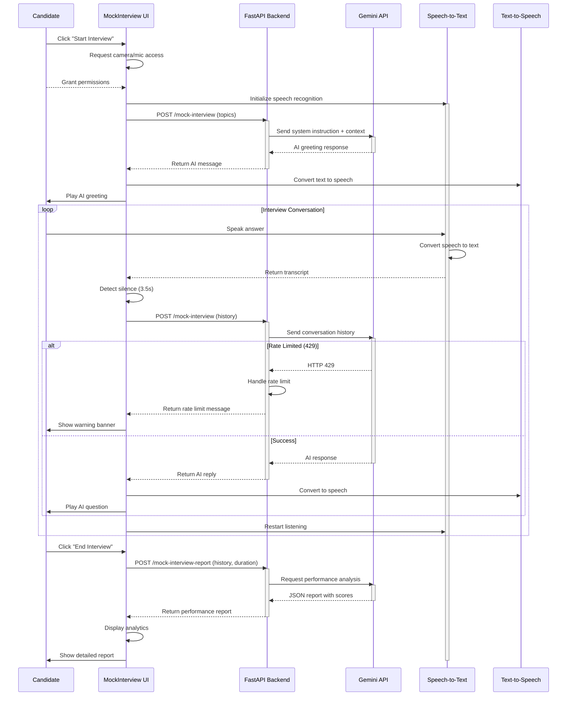
```mermaid
sequenceDiagram
    participant C as Candidate
    participant UI as MockInterview UI
    participant BE as FastAPI Backend
    participant Gemini as Gemini API
    participant STT as Speech-to-Text
    participant TTS as Text-to-Speech

    C->>UI: Click "Start Interview"
    UI->>UI: Request camera/mic access
    C-->>UI: Grant permissions
    UI->>STT: Initialize speech recognition
    activate STT
    
    UI->>BE: POST /mock-interview (topics)
    activate BE
    BE->>Gemini: Send system instruction + context
    activate Gemini
    Gemini-->>BE: AI greeting response
    deactivate Gemini
    BE-->>UI: Return AI message
    deactivate BE
    
    UI->>TTS: Convert text to speech
    UI->>C: Play AI greeting
    
    loop Interview Conversation
        C->>STT: Speak answer
        STT->>STT: Convert speech to text
        STT-->>UI: Return transcript
        
        UI->>UI: Detect silence (3.5s)
        UI->>BE: POST /mock-interview (history)
        activate BE
        BE->>Gemini: Send conversation history
        activate Gemini
        
        alt Rate Limited (429)
            Gemini-->>BE: HTTP 429
            BE->>BE: Handle rate limit
            BE-->>UI: Return rate limit message
            UI->>C: Show warning banner
        else Success
            Gemini-->>BE: AI response
            deactivate Gemini
            BE-->>UI: Return AI reply
            deactivate BE
            
            UI->>TTS: Convert to speech
            UI->>C: Play AI question
        end
        
        UI->>STT: Restart listening
    end
    
    C->>UI: Click "End Interview"
    UI->>BE: POST /mock-interview-report (history, duration)
    activate BE
    BE->>Gemini: Request performance analysis
    activate Gemini
    Gemini-->>BE: JSON report with scores
    deactivate Gemini
    BE-->>UI: Return performance report
    deactivate BE
    
    UI->>UI: Display analytics
    UI->>C: Show detailed report
    deactivate STT
```

---

### 3. Resume Upload & Parsing Sequence

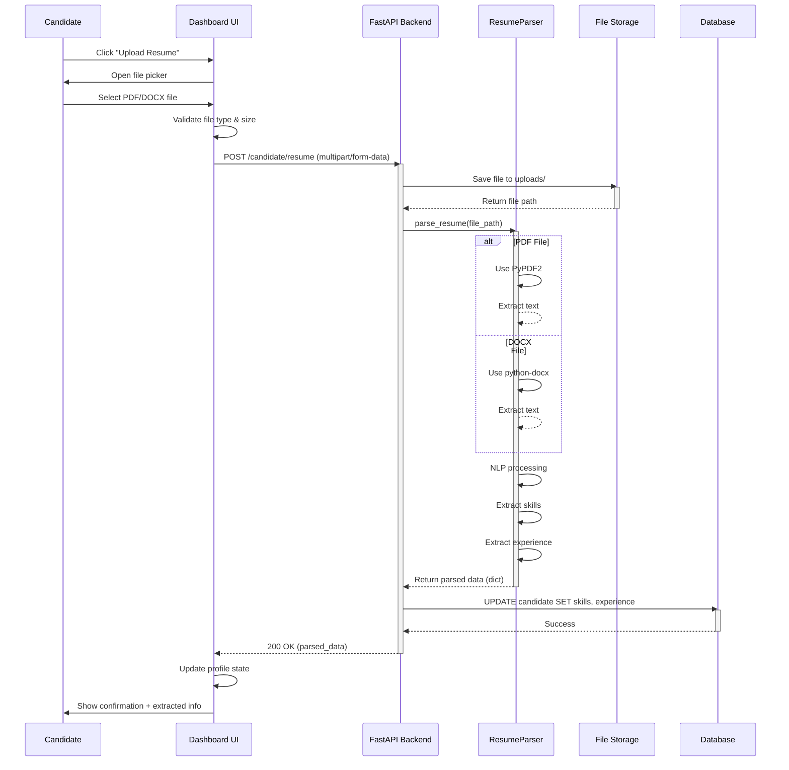
```mermaid
sequenceDiagram
    participant C as Candidate
    participant UI as Dashboard UI
    participant BE as FastAPI Backend
    participant Parser as ResumeParser
    participant FS as File Storage
    participant DB as Database

    C->>UI: Click "Upload Resume"
    UI->>C: Open file picker
    C->>UI: Select PDF/DOCX file
    UI->>UI: Validate file type & size
    
    UI->>BE: POST /candidate/resume (multipart/form-data)
    activate BE
    
    BE->>FS: Save file to uploads/
    activate FS
    FS-->>BE: Return file path
    deactivate FS
    
    BE->>Parser: parse_resume(file_path)
    activate Parser
    
    alt PDF File
        Parser->>Parser: Use PyPDF2
        Parser-->>Parser: Extract text
    else DOCX File
        Parser->>Parser: Use python-docx
        Parser-->>Parser: Extract text
    end
    
    Parser->>Parser: NLP processing
    Parser->>Parser: Extract skills
    Parser->>Parser: Extract experience
    Parser-->>BE: Return parsed data (dict)
    deactivate Parser
    
    BE->>DB: UPDATE candidate SET skills, experience
    activate DB
    DB-->>BE: Success
    deactivate DB
    
    BE-->>UI: 200 OK (parsed_data)
    deactivate BE
    
    UI->>UI: Update profile state
    UI->>C: Show confirmation + extracted info
```

---

### 4. Job Application Sequence

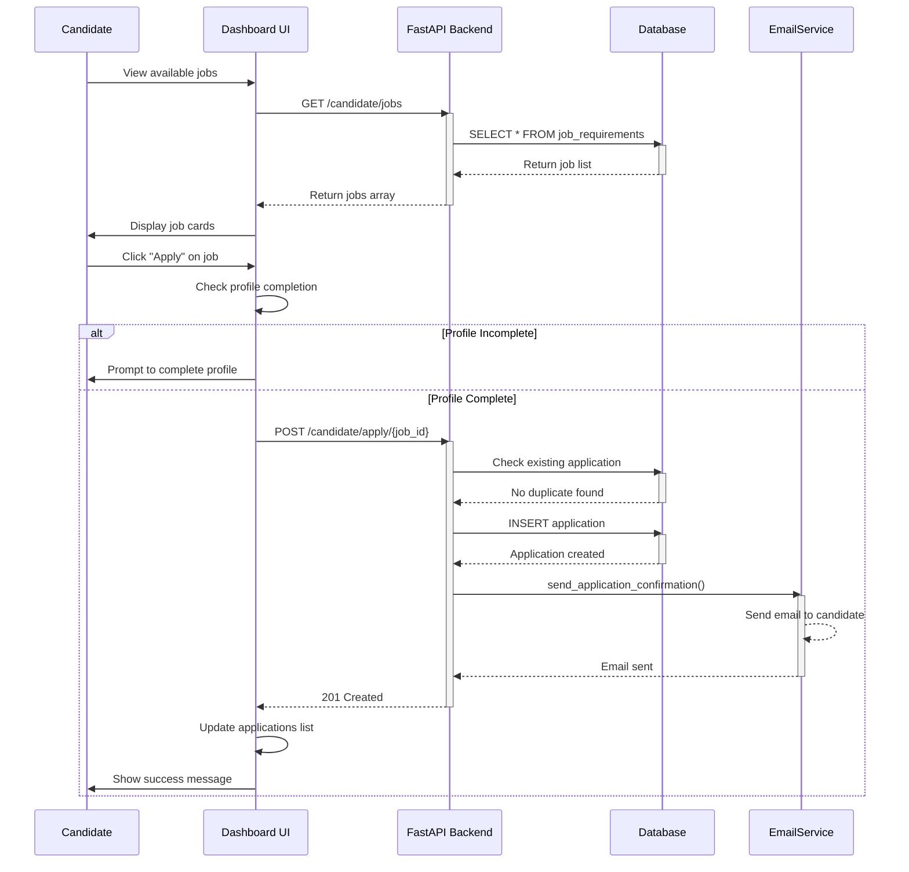
```mermaid
sequenceDiagram
    participant C as Candidate
    participant UI as Dashboard UI
    participant BE as FastAPI Backend
    participant DB as Database
    participant Email as EmailService

    C->>UI: View available jobs
    UI->>BE: GET /candidate/jobs
    activate BE
    BE->>DB: SELECT * FROM job_requirements
    activate DB
    DB-->>BE: Return job list
    deactivate DB
    BE-->>UI: Return jobs array
    deactivate BE
    
    UI->>C: Display job cards
    
    C->>UI: Click "Apply" on job
    UI->>UI: Check profile completion
    
    alt Profile Incomplete
        UI->>C: Prompt to complete profile
    else Profile Complete
        UI->>BE: POST /candidate/apply/{job_id}
        activate BE
        
        BE->>DB: Check existing application
        activate DB
        DB-->>BE: No duplicate found
        deactivate DB
        
        BE->>DB: INSERT application
        activate DB
        DB-->>BE: Application created
        deactivate DB
        
        BE->>Email: send_application_confirmation()
        activate Email
        Email-->>Email: Send email to candidate
        Email-->>BE: Email sent
        deactivate Email
        
        BE-->>UI: 201 Created
        deactivate BE
        
        UI->>UI: Update applications list
        UI->>C: Show success message
    end
```

---

### 5. Online Exam Sequence

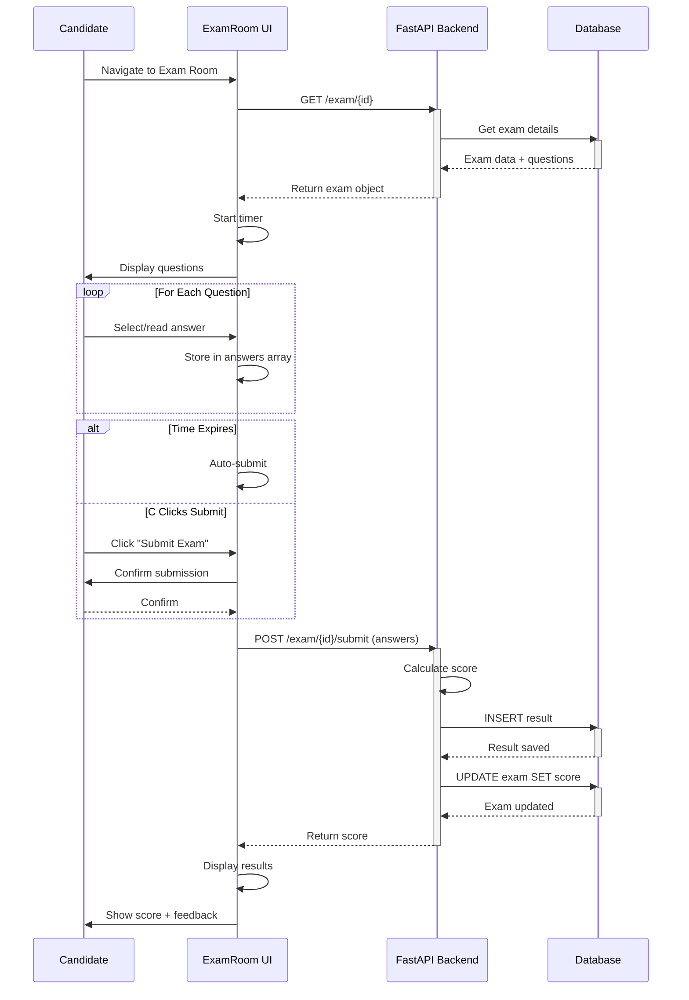
```mermaid
sequenceDiagram
    participant C as Candidate
    participant UI as ExamRoom UI
    participant BE as FastAPI Backend
    participant DB as Database

    C->>UI: Navigate to Exam Room
    UI->>BE: GET /exam/{id}
    activate BE
    
    BE->>DB: Get exam details
    activate DB
    DB-->>BE: Exam data + questions
    deactivate DB
    
    BE-->>UI: Return exam object
    deactivate BE
    
    UI->>UI: Start timer
    UI->>C: Display questions
    
    loop For Each Question
        C->>UI: Select/read answer
        UI->>UI: Store in answers array
    end
    
    alt Time Expires
        UI->>UI: Auto-submit
    else C Clicks Submit
        C->>UI: Click "Submit Exam"
        UI->>C: Confirm submission
        C-->>UI: Confirm
    end
    
    UI->>BE: POST /exam/{id}/submit (answers)
    activate BE
    
    BE->>BE: Calculate score
    BE->>DB: INSERT result
    activate DB
    DB-->>BE: Result saved
    deactivate DB
    
    BE->>DB: UPDATE exam SET score
    activate DB
    DB-->>BE: Exam updated
    deactivate DB
    
    BE-->>UI: Return score
    deactivate BE
    
    UI->>UI: Display results
    UI->>C: Show score + feedback
```

---

### 6. Admin Shortlisting Sequence

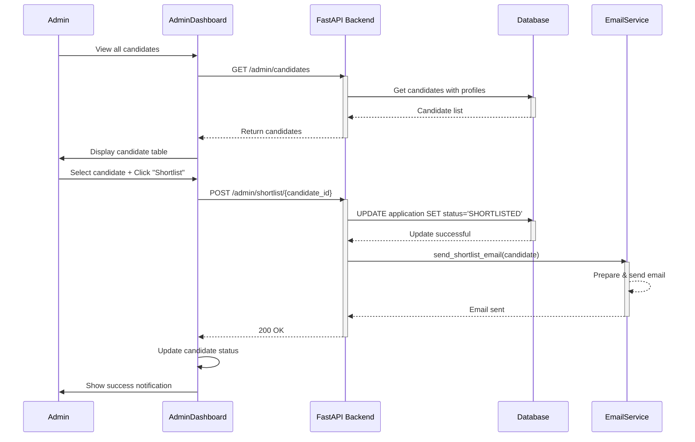
```mermaid
sequenceDiagram
    participant A as Admin
    participant UI as AdminDashboard
    participant BE as FastAPI Backend
    participant DB as Database
    participant Email as EmailService

    A->>UI: View all candidates
    UI->>BE: GET /admin/candidates
    activate BE
    BE->>DB: Get candidates with profiles
    activate DB
    DB-->>BE: Candidate list
    deactivate DB
    BE-->>UI: Return candidates
    deactivate BE
    
    UI->>A: Display candidate table
    
    A->>UI: Select candidate + Click "Shortlist"
    UI->>BE: POST /admin/shortlist/{candidate_id}
    activate BE
    
    BE->>DB: UPDATE application SET status='SHORTLISTED'
    activate DB
    DB-->>BE: Update successful
    deactivate DB
    
    BE->>Email: send_shortlist_email(candidate)
    activate Email
    Email-->>Email: Prepare & send email
    Email-->>BE: Email sent
    deactivate Email
    
    BE-->>UI: 200 OK
    deactivate BE
    
    UI->>UI: Update candidate status
    UI->>A: Show success notification
```

---

### 7. Password Reset Sequence

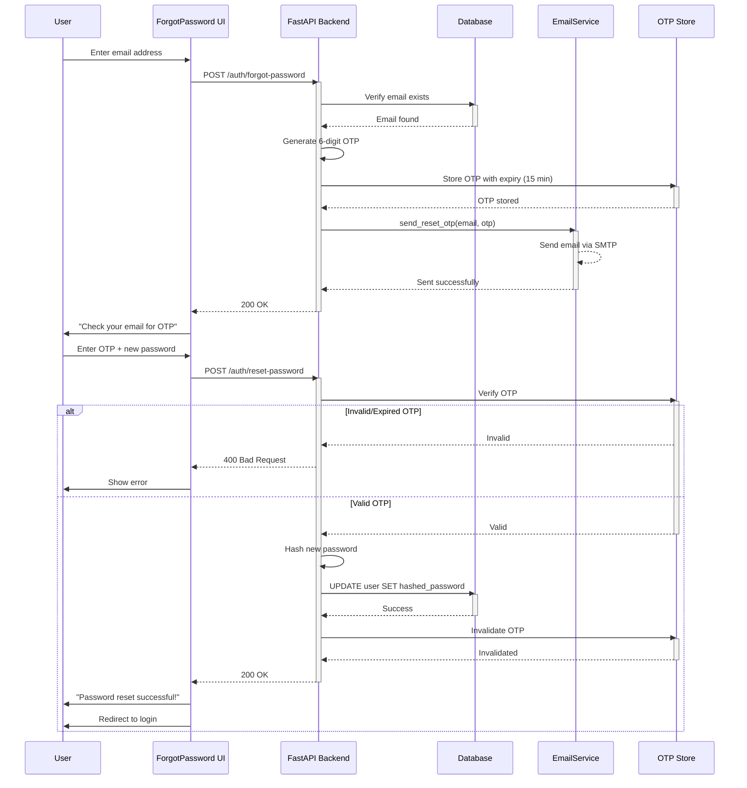
```mermaid
sequenceDiagram
    participant U as User
    participant UI as ForgotPassword UI
    participant BE as FastAPI Backend
    participant DB as Database
    participant Email as EmailService
    participant OTP as OTP Store

    U->>UI: Enter email address
    UI->>BE: POST /auth/forgot-password
    activate BE
    
    BE->>DB: Verify email exists
    activate DB
    DB-->>BE: Email found
    deactivate DB
    
    BE->>BE: Generate 6-digit OTP
    BE->>OTP: Store OTP with expiry (15 min)
    activate OTP
    OTP-->>BE: OTP stored
    deactivate OTP
    
    BE->>Email: send_reset_otp(email, otp)
    activate Email
    Email-->>Email: Send email via SMTP
    Email-->>BE: Sent successfully
    deactivate Email
    
    BE-->>UI: 200 OK
    deactivate BE
    
    UI->>U: "Check your email for OTP"
    
    U->>UI: Enter OTP + new password
    UI->>BE: POST /auth/reset-password
    activate BE
    
    BE->>OTP: Verify OTP
    activate OTP
    alt Invalid/Expired OTP
        OTP-->>BE: Invalid
        BE-->>UI: 400 Bad Request
        UI->>U: Show error
    else Valid OTP
        OTP-->>BE: Valid
        deactivate OTP
        
        BE->>BE: Hash new password
        BE->>DB: UPDATE user SET hashed_password
        activate DB
        DB-->>BE: Success
        deactivate DB
        
        BE->>OTP: Invalidate OTP
        activate OTP
        OTP-->>BE: Invalidated
        deactivate OTP
        
        BE-->>UI: 200 OK
        deactivate BE
        
        UI->>U: "Password reset successful!"
        UI->>U: Redirect to login
    end
```

---

### 8. AI Chatbot Interaction Sequence

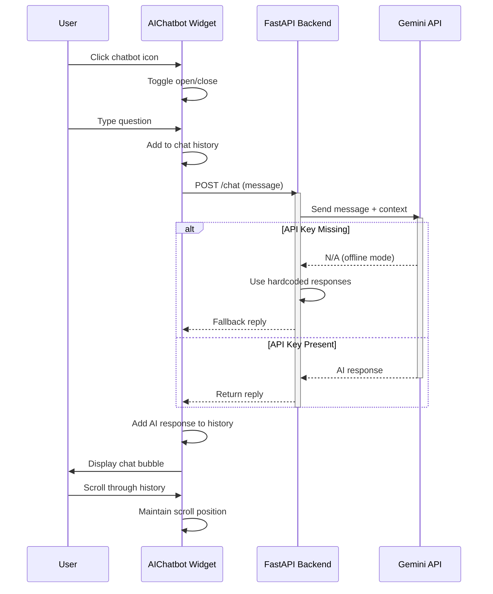
```mermaid
sequenceDiagram
    participant U as User
    participant Widget as AIChatbot Widget
    participant BE as FastAPI Backend
    participant Gemini as Gemini API

    U->>Widget: Click chatbot icon
    Widget->>Widget: Toggle open/close
    
    U->>Widget: Type question
    Widget->>Widget: Add to chat history
    Widget->>BE: POST /chat (message)
    activate BE
    
    BE->>Gemini: Send message + context
    activate Gemini
    
    alt API Key Missing
        Gemini-->>BE: N/A (offline mode)
        BE->>BE: Use hardcoded responses
        BE-->>Widget: Fallback reply
    else API Key Present
        Gemini-->>BE: AI response
        deactivate Gemini
        BE-->>Widget: Return reply
    end
    
    deactivate BE
    
    Widget->>Widget: Add AI response to history
    Widget->>U: Display chat bubble
    
    U->>Widget: Scroll through history
    Widget->>Widget: Maintain scroll position
```

---

## 📊 Activity Diagrams

### 1. Candidate Registration Flow

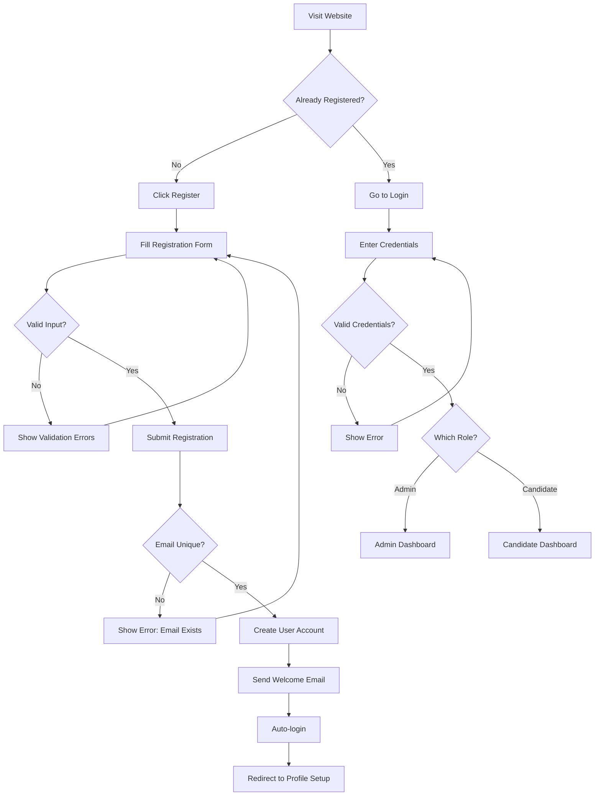
```mermaid
flowchart TD
    A[Visit Website] --> B{Already Registered?}
    B -->|No| C[Click Register]
    B -->|Yes| D[Go to Login]
    
    C --> E[Fill Registration Form]
    E --> F{Valid Input?}
    F -->|No| G[Show Validation Errors]
    G --> E
    
    F -->|Yes| H[Submit Registration]
    H --> I{Email Unique?}
    I -->|No| J[Show Error: Email Exists]
    J --> E
    
    I -->|Yes| K[Create User Account]
    K --> L[Send Welcome Email]
    L --> M[Auto-login]
    M --> N[Redirect to Profile Setup]
    
    D --> O[Enter Credentials]
    O --> P{Valid Credentials?}
    P -->|No| Q[Show Error]
    Q --> O
    
    P -->|Yes| R{Which Role?}
    R -->|Admin| S[Admin Dashboard]
    R -->|Candidate| T[Candidate Dashboard]
```

---

### 2. AI Mock Interview Decision Flow

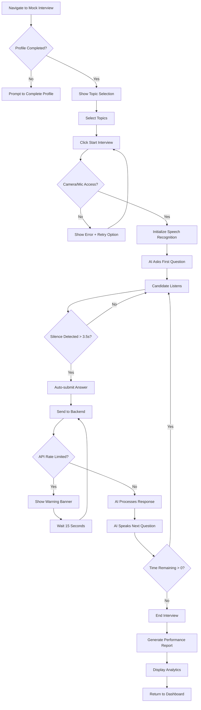
```mermaid
flowchart TD
    A[Navigate to Mock Interview] --> B{Profile Completed?}
    B -->|No| C[Prompt to Complete Profile]
    B -->|Yes| D[Show Topic Selection]
    
    D --> E[Select Topics]
    E --> F[Click Start Interview]
    F --> G{Camera/Mic Access?}
    G -->|No| H[Show Error + Retry Option]
    H --> F
    
    G -->|Yes| I[Initialize Speech Recognition]
    I --> J[AI Asks First Question]
    
    J --> K[Candidate Listens]
    K --> L{Silence Detected > 3.5s?}
    L -->|No| K
    L -->|Yes| M[Auto-submit Answer]
    
    M --> N[Send to Backend]
    N --> O{API Rate Limited?}
    O -->|Yes| P[Show Warning Banner]
    P --> Q[Wait 15 Seconds]
    Q --> N
    
    O -->|No| R[AI Processes Response]
    R --> S[AI Speaks Next Question]
    
    S --> T{Time Remaining > 0?}
    T -->|Yes| K
    T -->|No| U[End Interview]
    
    U --> V[Generate Performance Report]
    V --> W[Display Analytics]
    W --> X[Return to Dashboard]
```

---

## 🎯 State Machine Diagrams

### 1. Application Status Lifecycle

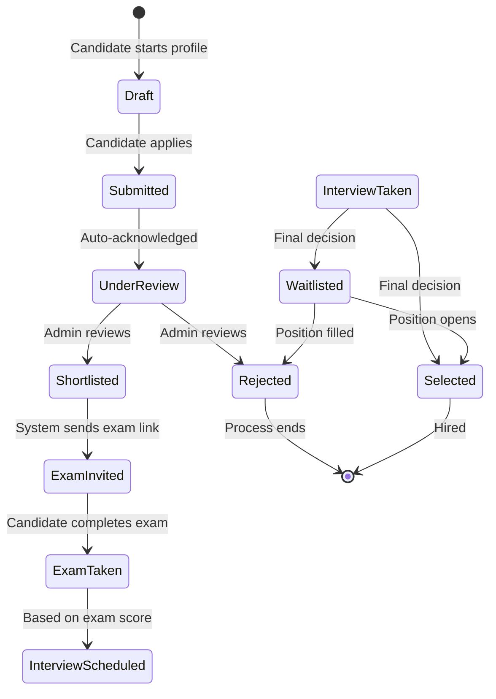
```mermaid
stateDiagram-v2
    [*] --> Draft: Candidate starts profile
    Draft --> Submitted: Candidate applies
    Submitted --> UnderReview: Auto-acknowledged
    UnderReview --> Shortlisted: Admin reviews
    UnderReview --> Rejected: Admin reviews
    Shortlisted --> ExamInvited: System sends exam link
    ExamInvited --> ExamTaken: Candidate completes exam
    ExamTaken --> InterviewScheduled: Based on exam score
    InterviewTaken --> Selected: Final decision
    InterviewTaken --> Waitlisted: Final decision
    Rejected --> [*]: Process ends
    Selected --> [*]: Hired
    Waitlisted --> Selected: Position opens
    Waitlisted --> Rejected: Position filled
```

---

### 2. Exam State Transitions

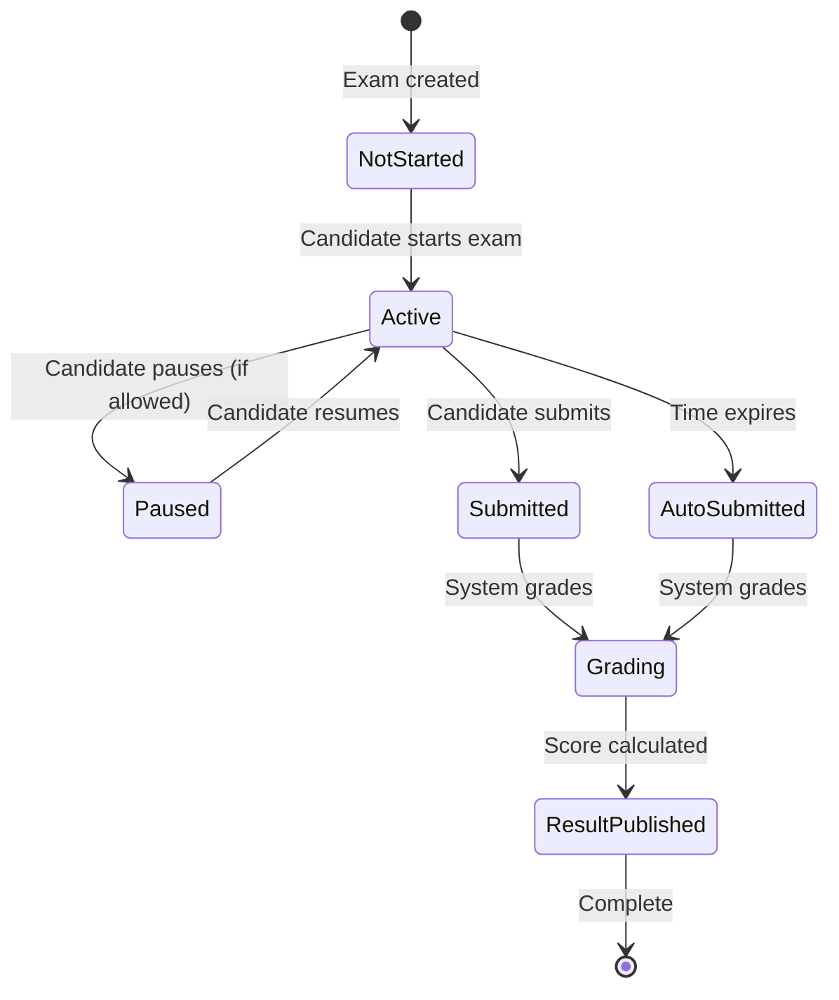
```mermaid
stateDiagram-v2
    [*] --> NotStarted: Exam created
    NotStarted --> Active: Candidate starts exam
    Active --> Paused: Candidate pauses (if allowed)
    Paused --> Active: Candidate resumes
    Active --> Submitted: Candidate submits
    Active --> AutoSubmitted: Time expires
    Submitted --> Grading: System grades
    AutoSubmitted --> Grading: System grades
    Grading --> ResultPublished: Score calculated
    ResultPublished --> [*]: Complete
```

---

## 📋 Deployment Diagram

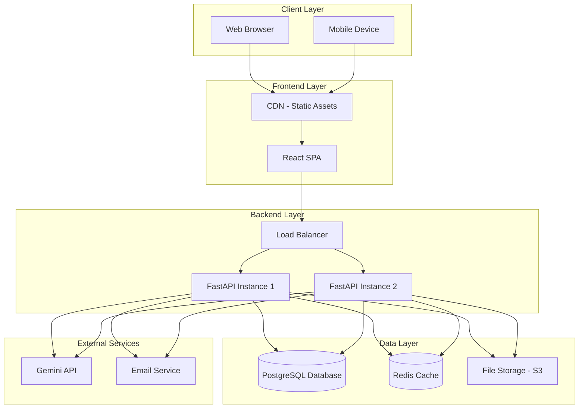
```mermaid
flowchart TB
    subgraph Client["Client Layer"]
        Browser[Web Browser]
        Mobile[Mobile Device]
    end
    
    subgraph Frontend["Frontend Layer"]
        CDN[CDN - Static Assets]
        React[React SPA]
    end
    
    subgraph Backend["Backend Layer"]
        LB[Load Balancer]
        API1[FastAPI Instance 1]
        API2[FastAPI Instance 2]
    end
    
    subgraph Data["Data Layer"]
        DB[(PostgreSQL Database)]
        Cache[(Redis Cache)]
        Storage[File Storage - S3]
    end
    
    subgraph External["External Services"]
        Gemini[Gemini API]
        SMTP[Email Service]
    end
    
    Browser --> CDN
    Mobile --> CDN
    CDN --> React
    React --> LB
    LB --> API1
    LB --> API2
    API1 --> DB
    API2 --> DB
    API1 --> Cache
    API2 --> Cache
    API1 --> Storage
    API2 --> Storage
    API1 --> Gemini
    API2 --> Gemini
    API1 --> SMTP
    API2 --> SMTP
```

---

**End of UML Diagrams**
